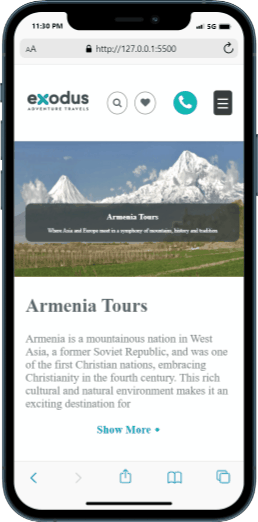

##Armenia Tours Website Documentation##

#Table of Contents#
1. Introduction
2. HTML Structure
3. CSS Styles
4. JavaScript Functionality
5. Responsive Design
6. Media Queries
7. Event Handling
8. Credits

## Demo

1. Introduction
The Armenia Tours website is a travel destination showcase, providing information about Armenia's culture, history, and activities. This documentation outlines the structure of the web page and explains the styling and functionality.

2. HTML Structure
The HTML structure consists of the main components:
Header: Navigation and contact information.
Main Section: Divided into two parts, showcasing a background image and a description/form container.

3. CSS Styles
CSS is used to style the webpage, creating an aesthetically pleasing and responsive design.

Header Styling: Styling for the navigation bar, logo, and contact information.
Section 1 Styling: Styling for the main image and centered container.
Section 2 Styling: Styling for the description and form container.

4. JavaScript Functionality
JavaScript provides functionality for handling user interactions, such as the "Show More" button.

The handleShowMore function toggles the visibility of additional text when a button is clicked. It checks the button's text content and shows or hides the extra text accordingly. 

5. Responsive Design
The Armenia Tours website is designed to be responsive, adapting to different screen sizes to provide an optimal viewing experience for users on various devices.

6. Media Queries
Media queries are implemented to adjust styles for different screen sizes, ensuring a seamless user experience across a range of devices.

css
@media (max-width: 768px) {
  /* Media query styles for medium screens */
}

@media (max-width: 480px) {
  /* Media query styles for smaller screens */
}

@media (max-width: 350px) {
  /* Additional media query styles for even smaller screens */
}

7. Event Handling
JavaScript event handling is implemented for the "Show More" button, providing users with a dynamic way to reveal and hide additional content within the description section.

<!-- <h3>Show More 🠻</h3> -->

7. Credits
This website acknowledges the usage of third-party resources for icons.

Font Awesome for providing icon assets.

## Testing

### Cypress E2E Tests

**Prerequisites:**
- [Node.js](https://nodejs.org/) must be installed.

**Running the Tests:**
1. Clone the repository: `git clone <repository-url>`
2. Install dependencies: `npm install`
3. Run Cypress tests: `npx cypress open`

#### Test Case: Show More Functionality on Small Screens

- **Description:** Ensures the "Show More" button toggles additional text visibility on small screens.
- **Steps:**
  1. Set viewport to simulate a small screen.
  2. Visit Armenia Tours website.
  3. Click "Show More" button.
  4. Assert additional text is visible.
  5. Click "Show Less" button.
  6. Assert additional text is hidden.

**Note:**
- Testing utilizes Cypress for end-to-end (E2E) testing.
- Ensure the application is running on a testable environment before running tests.
